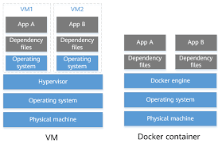

### Virtual Machines
A VM is a software that emulates an entire computer, with its kernel, architecture and resurces.  

### Containers
Containers are virtual environments that keep applications and software isolated from the host system.
Containers have been around for a long time but building them manually can be challenging, this is where Docker comes in.
Docker uses existing container engines to provide consistent containers 

### VM vs Containers

There is no "which is better" argument here as each one has its own use cases and benefits and disadvantges

But some differences to note:

* VMs are larger in size and resource consumption
* Containers require a Linux kernel to operate while VMs can be run on any OS 
* Containers are usually faster and use resource needed only

The image below show differences between VMs and Containers.

----

 
### Images

Image is a packaged application that contains all dependencies, source codeand complete environment and configurations of that application, think of it as a blueprint that you use to create instances of the application, these instances are containers.

## What is Docker

Docker is a command-line program, a background daemon, and a set of remote services that take a logistical approach to solving common software problems and simplifying your experience installing, running, publishing, and removing software. It
accomplishes this using a UNIX technology called containers

--------

## Installing Docker

Docker requires a Linux kernel to run, however now you don't need to run a Linux machine to run Docker, if you are on Windows you can use Windows Subsystem for Linux (WSL) which allows you to run a Linux environment in your Windows machine.

You can find a guide on how to install Docker on WSL [here](https://drive.google.com/drive/folders/1zHdFbbcLQXjtZ_55CDosMGEkqXXgwlYw?usp=sharing)

---

On linux you can install Docker from your package manager

* `sudo apt install docker` on Debian and Ubuntu based ditros
* `sudo dnf install docker` on Fedora based distros
* `sudo pacman -Syu docker` in Arch based distros

## Using WSL

WSL provides you with a Linux environment and the BASH shell, we will go through some basic commands to help you navigate through the Bash shell.

## Basic Bash commands

`cd` stands for Change Directory, use it to go to another directory (folder)

`ls` stands for List, use it to list all files and directories in your working directory

`touch` creates a file

`cp` stands for Copy

`mv` stands for Move, same thing as Cut (Ctrl + X)

`rm` stands for Remove, deletes files

`mkdir` stands for Make Directory, use it to create new directories (folders)

`cat` prints contents of a file

## Basic Docker commands

Docker offers lots of functionalties and has lots of commands for specific uses, we will look now at the most common commands that are used with Docker
 
Before using any of these commands we must write `docker` before it.

 ---

### `run` starts a container
 
 Syntax: `docker run <image_name>`

 If the image is downloaded it will start, otherwise it is pulled and downloaded on your machine first.

 

 --- 

### `ps` lists containers

 Syntax: `docker ps`

 Lists all running containers, and some basic info about them (image, id, name, etc...)

 

 If we want to list all containers, running or not, we use the `-a` option.

 

 ---

 ### `start` starts containers

 Syntax: `docker start <container_name>` or `docker start <container_ID>`

 If we have a container that is exited or not running in general, we use `start` to start it

 
 
 Here we have container `test_ubuntu` which is not running

 
 

 Using the name or the ID we can start it.

 

 ---

 ### `stop` stops containers

 Syntax: `docker stop <container_ID>` or `docker stop <container_name>`

 We need to pass the container ID or container name to stop a container, we can find those from the `docker ps` command.

 
 

 After running `docker stop` it will print out the name or the ID that we passed.

 ---

 ### `rm` removes containers

 Like `stop` we pass either the name or ID of the container, if removed succesfully, it will print out what we passed to it.

 
 

 ### `images` lists images

 

 ---

 ### `rmi` removes images

 If we want to delete an image, we must remove all dependent containers first.

 

 Here we tried to delete the image `redis` but we had redis containers, even though they were stopped, it printed an error.

 

 After deleting the redis containers we can remove the redis image succesfully 

 ### `pull` downloads images

 We saw earlier that when running `docker run` it checks, if the image isn't available on the machine, it downloads it then runs it in a container directly.

 What if we want to only download an image without running a container?

 We use `docker pull` which "pulls" the image without creating a container

 

 ----------

 When we run a linux container we will notice that it exits immediately, why is that?

 Containers are not meant to host an OS, it is meant to run a specific task or process, such as host an instance of a web server, database, or simply to carry a computation or analysis task, once this task is complete, it exits.

 This is why when we run an image of an OS, say Ubuntu, it exits immediately.

 ### Appending commands

 We can append commands after `docker run` to run a specific command in the container when it starts.
 
 For example `docker run ubuntu sleep 10`
 will start an Ubuntu container and executes `sleep 10` and after the command exits the container exits too.

 ### `exec` executes commands

 Okay so we saw how to run a command when we are creating the container, what if we have an already running container, how can we execute a command on it?

 We use `docker exec <container_name> <command>`

 

 Here we have a running Ubuntu container, we want to print the contents of the `/etc/hosts` file

 

----------------

## Docker run

One of the most commands that we use throught our usage of Docker is `run` and it has many options that we benefit from in configuring our containers, we will look at this command in some detail here.

### Tag

Tags are an identifier that is typically a version number or a variant of an image, if we don't specify a tag, the command uses `latest` by default.

Syntax: `<docker run image_name:tag>`

In the first image we didn't specify a tag so it pulled `latest`, in the second we specified tag `3.18`.

To find all the tags relating to an image we look this image up on [Docker Hub](https://hub.docker.com/) and we will see all tags there.

### Standard Input (stdin)

Suppose we have a program that takes input, say a script that takes your name and prints `Hello <your_name>`.

If we dockerize this program and run the container, it will not wait for the prompt, it will just print what it is supposed to on standard output.

This is because Docker containers doesn't listen to stdin, even though we are attached to the container's console, it's not able to read any input, it doesn't have a terminal, in other terms the container runs in non-interactive mode.

We have a program that takes a name and prints `Hello <name>`. This is it running normally

If we dockerize it and run the container this will happen

We notice 2 things, first that it didn't take our input (our name in this case), to solve this we add the `-i` flag, which runs the container in interactive mode

Now it takes our input and outputs correctly. But there is still the second problem, the prompt doesn't print, here it should ask first for the name but it doesn't, why? because the application prompts on the terminal and we haven't attached it to the container terminal.

To solve this we add the `-t` flag which stands for psuedo-terminal.

So together, `-it` when used with `docker run` it basically takes us straight into the container's terminal.

### Port Binding

If we have a web app or server running in a container it will be given an IP on the closed Docker network, so anything outside the container can't access it, to solve this we need to use port binding (mapping) which is binding or mapping the container's port to the hosts's port to make the service available outside the container

nginx is a web server which runs on port 80, if we try to access the localhost at port 80 we will get nothing because port 80 has nothing on it now, we bind port 80 in the container to port 8080 on the host so now accessing the localhost on port 8080 we can access our server.

Port mapping is done using the `-p` option with docker run

`docker run -p <host_port>:<container_port> <image_name>`

Note that only one service can run on this host port.

### Volume Mapping

Containers have their filesystem isolated from the host, so data stored and modified in the container aren't saved on the host. 

Let's say we have a database container, all data stored in this DB in stored in the container, if this container is removed, all data on the database is lost.

To solve this issue we use volume mapping, where as in port mapping, we map a volume on our container to a volume on our host so data are saved on host and independent of the container in a way.

Volume mapping is done by using the `-v` flag with docker `run`

`docker run -v <host_volume>:<container_volume> <image_name>`
