## Images

As we prevoiusly said, an image is a packaged application containing the source code and all dependencies of an application.

We will look now at how to make our own images.

#### But, why would we want to create our own images?

There are many reasons we might need that including:

* Sometimes we can't find the service we want as an image
* We want our application to be dockerized for ease of shipping and deployment 

---

#### OK, so how do we go about creating our own images?

To take our created application and package it into a Docker image we need to create a "defention" on how to build an image from our app, in other words we need to write instructions on how to build our app.

This "defention" is written in a text file called `Dockerfile` 

* Dockerfile contains commands to assemble an image
* Docker can build images by reading those commands

We will use a simple Node.js app, we don't need to look into the specifics of how it is written, but we will focus on its output and how Docker affects it.

The application basically listens on port 3000 and prints welcome when accessed from the browser, also we have a json file which has dependencies for the library we are using.

---

## Dockerfile

To start building our image we first need to create our Dockerfile, most text editors recognize this file

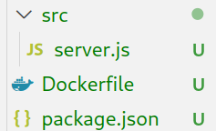

### Structue of Dockerfile

- Dockerfile start from a parent image or "base image".
- It's a Docker image that your image is based on.
- We choose the base image dependingon the tools we need to have.
  - For example here we need a base image that has `npm` installed, `npm` is a package manager for JavaScript and it installs most Node.js libraries.
  
- Dockerfile consists of instructions and arguments, we will look at some of these instructions as we go on building our server.

---

### `FROM`

First instruction we have is `FROM`,  all Dockerfiles *must* start with a `FROM` instruction.

`FROM` specifies the base image we are building our image on.

Base images are Linux images most of the time, in our case here we will also need a Linux image to base on but also we need to have `npm` installed on it so we can install any libraries needed for the server.

One such image is `node:19-alpine`, his image is a Node.js image based on the `alpine` image and has `npm` installed, this will do fine for us.

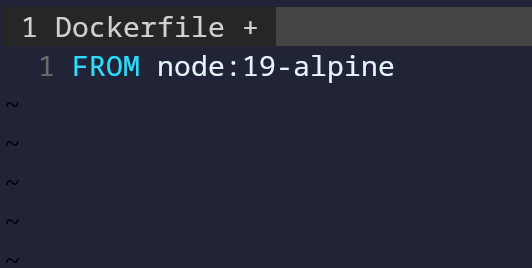

---

## `RUN`

If we want to install a library using `npm` we use `npm install <package_name>` and on our image we will need to install the library we need for our app which is `express`.

To execute any command in a shell *inside* the container environment

So here we use `RUN npm install` to have npm install all dependencies for our app.

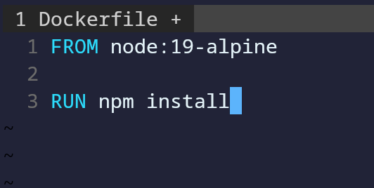

---

## `COPY`

OK so we now have our base image and installed our dependencies, are we ready to run the script now? Well, no.

We still don't have our app's files in the container, they are on our host system only.

To put our app in the container we use the `COPY` intstruction.

We can copy individual files like `package.json`

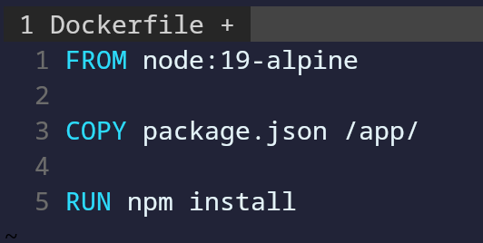

We can also copy entire folders.

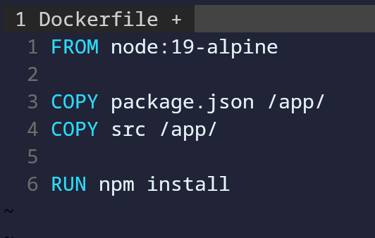

**Important thing to notice**: The `/` after `app` is important as it tells Docker to create this folder if doesn't exist in the container.

`RUN` is executed in the container while `COPY` is executed on the host.

---

## `WORKDIR`

Now are app's files is in the container but are we?

By default we are in the root directory of the container `/` while we copied our app to `/app`, we need to go to `/app`, if we were on the host we could use `cd`, well in Dockerfile we use `WORKDIR` and give it the directory we want as our working directory for all following commands.

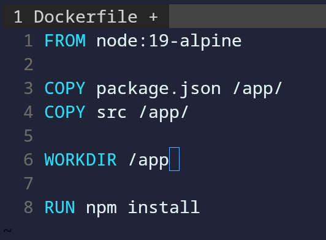

---

## `CMD`

So we have chosen a base image, copied app files, set our working directories and installed dependencies, we are now ready to finally ready to run our app.

To do that, we use `CMD` 

`CMD` has a specific syntax which goes as the following:

    `CMD ["command","parameter"]`

To run a server with Node.js we use `node server.js` command, so we pass it in the Dockerfile with `CMD`

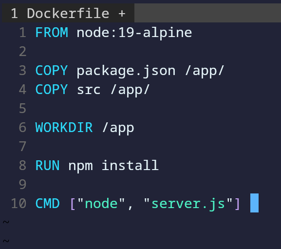

Note that `CMD` is the last instruction to run in the Dockerfile and it executes when the container starts.

Also note that we can have *one* `CMD` instruction in the Dockerfile.

---

## `CMD` vs `RUN`

OK so we may notice that both `RUN` and `CMD` are used to execute temrinal commands, so what is the differnece between them?

`RUN` is an image build step, after each `RUN` instruction is committed to the container image, we can have many `RUN` instructions as we want.

`CMD` executes by default when a container from the image is started, there can be only on `CMD` in the Dockerfile.

---

## Building the image

Now that we have written our Dockerfile, we have given Docker instructions to make an image.

To build an image we use the `build` command.

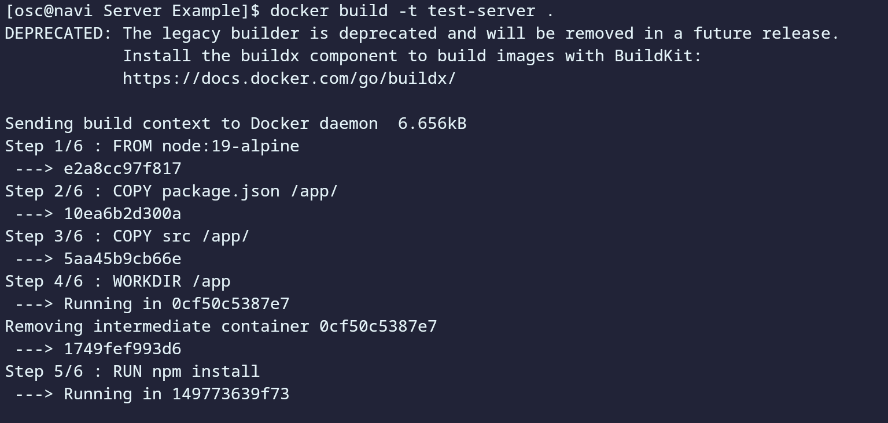
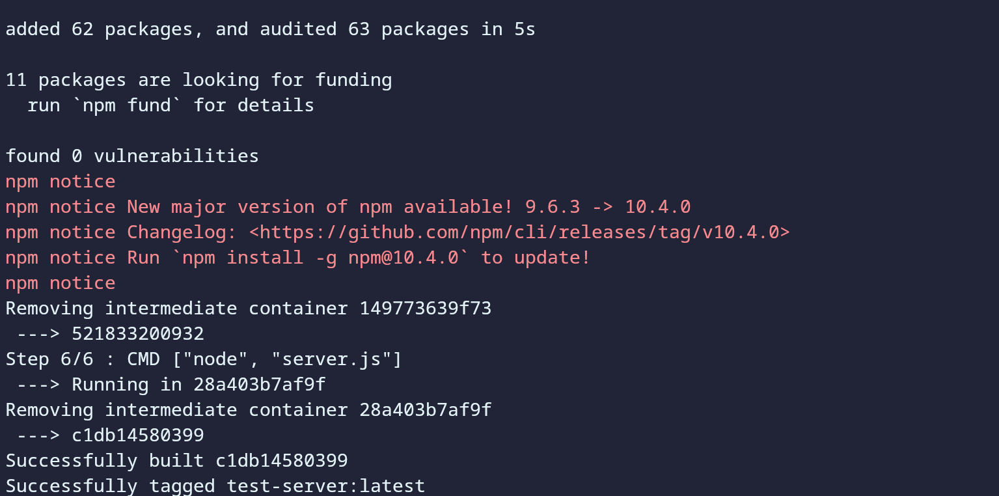

We use the `-t` option to give our image a name and optionally a tag.

--- 

## Layered architecture

When Docker builds images, it does so in a layered architecture.

Each instruction creates a new layer with in the Docker image with just the changes from the previous layer.

So the `FROM` instruction is our first layer, the first `COPY` is another layer which builds on the first and so on.

---

## Docker inspect

Every image is built using a Dockerfile, we can view how it is constructed in detail by inspecting the image using `docker inspect <image>`

The output of `inspect` isn't the exact Dockerfile but some of the instructions can be found in the output, for example, the `CMD` argument, size of image, working directory and other useful data.

From the things we can see in the `inspect` output is something called `Env`

### Docker Environment

A Docker container is as we said an isolated environment, so it has its own variables that define important paths, variables, configurations in it.

Some container require specific environment variables, like databases for example.

We can pass environment variables to a container using the `-e` or `--env` options

This is useful when we don't have many variables, but if we do we can use `--env-file` which we pass a text file containing all our variables.

---

## Entrypoint

As we previously said, containers are meant to run a specific task and to exit after completing it.

Linux containers by default don't have a process at the start so they exit immediately. This can be solved by appending commands to the `run` command.

Say what if we want an image to run a certain command always when it starts? We can build it and add a `CMD` instruction with the command we want.

For example, we want a alpine container that always runs `sleep 5` when it starts, so we make a container named `alpine-sleeper`

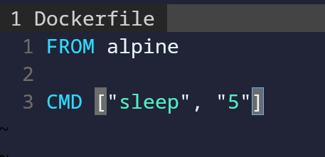

After building it and making a container from it, it will run `sleep 5` by default.

Now this image is called `alpine-sleeper` so it makes sense that it will alway run `sleep`, so appending `sleep` to it in `run` isn't sensful.

Can we make it so that we pass the number of seconds we want it to sleep directly?

Ex: `docker run alpine-sleeper 10`
runs `sleep 10`.

This is where the instruction `ENTRYPOINT` comes in. `ENTRYPOINT` is like `CMD` as you can specify the program that will run when the container starts and whatever we append to the `run` command is passed as an argument.

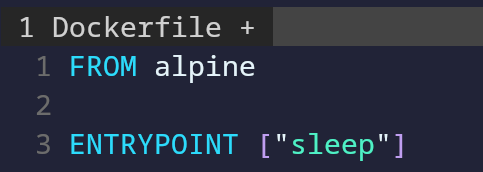

We should also add a `CMD` instruction after `ENTRYPOINT` as a failsafe, as if we don't append an argument to the `run` command an error will arise.

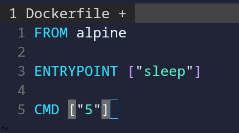

Lastly, we can specify a custom entrypoint by adding the `--entrypoint` option to `run`

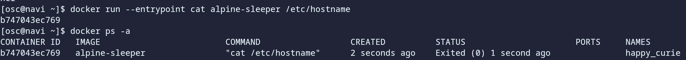