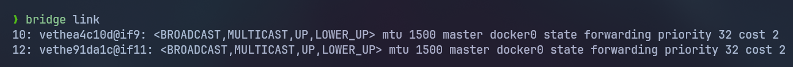

<!--_fontSize:13px-->>

# <!--fit--> Get to Docker
##  Session 3


---

## Agenda

- Docker Engine
- Configure resource constraints
- Layered Architcture
- Docker Storage
- Docker Networking


---

## Docker Engine

- When you install docker, you are actually installing 3 different components

  - The Docker CLI
  - The Docker Engine API
  - The Docker Daemon

---

## Docker Engine - Docker Daemon

- The Docker Daemon is the main component of the Docker Engine

- It is responsible for

  - Listening for Docker API requests
  - Managing Docker objects such as images, containers, volumes, and networks

---

## Docker Engine - Docker Engine API

- Docker provides an [API](https://docs.docker.com/engine/api/v1.44/) for interacting with the Docker daemon (called the Docker Engine API), as well as SDKs for Go and Python.

- It's a Restful API accessed via HTTP

- You can use the Docker CLI to send requests to the Docker API

- You can also use the Docker SDK to interact with the Docker API using different programming languages

---

## Docker Engine - Docker CLI

- The Docker CLI is a command-line tool that allows you to interact with the Docker daemon using commands

- It uses the Docker Engine API to interact with the docker daemon

- The Docker CLI need not nccearily be installed on the same machine as the Docker daemon

- You can use the Docker CLI to interact with a remote Docker daemon

---

## Configure resource constraints

- By default, a container has no resource constraints and can use as much of a given resource as the host's kernel scheduler allows

- Docker provides ways to control how much memory, or CPU a container can use, setting runtime configuration flags of the `docker run` command

- It achives this by using the `cgroups` feature of the Linux kernel

---

## Configure resource constraints

- Ex. Limiting the cpu usage of a container to `50%`

  

- Ex. Limiting the memory usage of a container to `1GB`

  

---

## Layered Architcture

- Docker uses a layered architecture to store images
- Each line in the Dockerfile creates a new layer in the image

- Example

    <div class="columns">
    <div>

  ```Dockerfile
  FROM Ubuntu:latest

  RUN apt-get update && apt-get install -y python3

  RUN pip3 install numpy

  COPY src1 /app

  CMD [ "python3", "src1/main.py" ]
  ```

    </div>

    <div>

  ```Dockerfile
  FROM Ubuntu:latest

  RUN apt-get update && apt-get install -y python3

  RUN pip3 install numpy

  COPY src2 /app

  CMD [ "python3", "src2/main.py" ]
  ```

    </div>

    </div>

- When build the second image, docker will reuse the first 3 layers from the cache and only create the last 2 layers

- This is how docker saves space and time when building images

---

## Docker Storage

- When first install docker it crates `/var/lib/docker`

- Inside this folder docker stores all its data **by default**

- By data we mean files related to images and containers running on the docker host

- For example

  - all files related to containers are stored under `/var/lib/docker/containers`

  - all files related to images are stored under `/var/lib/docker/image`

---

## Docker Storage

- When you build an image, the layers of the image become read-only, so you can't modify them

- If you want to mofiify them you have to initiate a new build

- All containers based on the same image **share** the same read-only layers

---

## Docker Storage

- When you run a container based of an image, docker create a new
  read-write layer on top of the read-only layers
- This layer is used to store data created by the container such as

  - Log files
  - Any temporary files generated by the container
  - Any file modified on that container

- This read-write layer is called the **container layer**

- When you stop the container, the container layer and all of the changes stored in it are **deleted**

---

## Docker Storage

- In the previous docker image, if we run a container based on that image and modify a file in the container (for example the src1/main.py), the file will be copied and the modifications will be stored in the copied version of the file in the container layer

- This is called **copy-on-write**

- By this mechanism, we can have multiple containers running on the same image and each container can have its own copy of the file with its own modifications

---

## Docker Storage - Volume Mounting

- We said that the container layer is deleted when the container is stopped and all the changes are lost, so how can we persist the changes?

- We can use **volumes**

- Volumes are a way to persist the data generated by the container

- Volumes are stored outside the container layer and are not deleted when the container is stopped

---

## Docker Storage - Volume Mounting

- You can create a volume using the

  ```docker
  docker volume create <volume-name>
  ```

- This will create a new folder under `/var/lib/docker/volumes/<volume-name>`

- You can then mount this volume to a container using the `-v` option, and specifying the name of the volume and the path of the folder on the container

  ```docker
  docker run -v <volume-name>:<container-path> <image-name>
  ```

- If the `<volume-name>` does not exist, docker will create it for you

- Example

  

---

## Docker Storage - bind mounting

- You can also mount a folder on the host machine to the container

- You will need to use the `-v` option and specify the path of the folder on the host machine and the path of the folder on the container

  ```docker
  docker run -v <path-on-host>:<path-on-container> <image-name>
  ```

- Example

  

---

## Docker Storage - Using `--mount` option

- You can also use the `--mount` option to mount volumes and bind mounts

- The `--mount` option is more flexible than the `-v` option

- You can use the `--mount` option to specify the type of the mount, the source of the mount, and the destination of the mount

- **Ex. Volume Mounting**

  

- **Ex. Bind Mounting**

  

---

## Hands-on

1. Crate a container from alpine image with max cpu usage of `50%` and max memory usage of `512m`

2. Create a volume called `myVolume` and mount it to a postgres container using `--mount` option

3. Create a folder called `myFolder` in your home directory and mount it to a postgres container **wihout** using `--mount` option

> Note $\to$ the location where postgres stores its data is `/var/lib/postgresql/data`

---

## Docker Networking

- When you install docker it creates 3 newtorks by default:

  - bridge
  - none
  - host

  

- to attach a container to a specific network you can use the `--network` option

  ```docker
  docker run --network <network-name> <image-name>
  ```

---

## Docker Networking - default bridge network

- private internal network created by docker on the host

- all containers attached to this netowrk by default and they get an internal IP address

- containers can communicate with each other using their internal IP addresses

- to access any container inside this network from outside the network you can use the port mapping

  ```docker
  docker run -p <host-port>:<container-port> <image-name>
  ```

---

## Docker Networking - default bridge network




---

## Docker Networking - default bridge network


---

## Docker Networking - none network

- When you run a container with the `--network none` option, the container does not get any network access

- This means that the container cannot communicate with the host or any other containers

- This is useful when you want to run a container in complete isolation

- You can still access the container using the `docker exec` command

---

## Docker Networking - none network


---

## Docker Networking - host network

- It is one of the 3 default networks created by docker

- When you run a container with the `--network host` option, the container shares the host's network stack

- This means that the container does not get its own network namespace, and it uses the host's network stack

- This removes the network isolation between the container and the host

---

## Docker Networking - host network


---

## Docker Networking - host network


---

## Docker Networking - user-defined bridge network

- You can create your own bridge network using the `docker network create` command

  ```docker
  docker network create <network-name>
  ```

- Containers attached to the same network can communicate with each other using their container names or their internal IP addresses

---

## Docker Networking - user-defined bridge network


---

## Docker Networking - user-defined bridge network


---

## Docker Networking - user-defined bridge network


