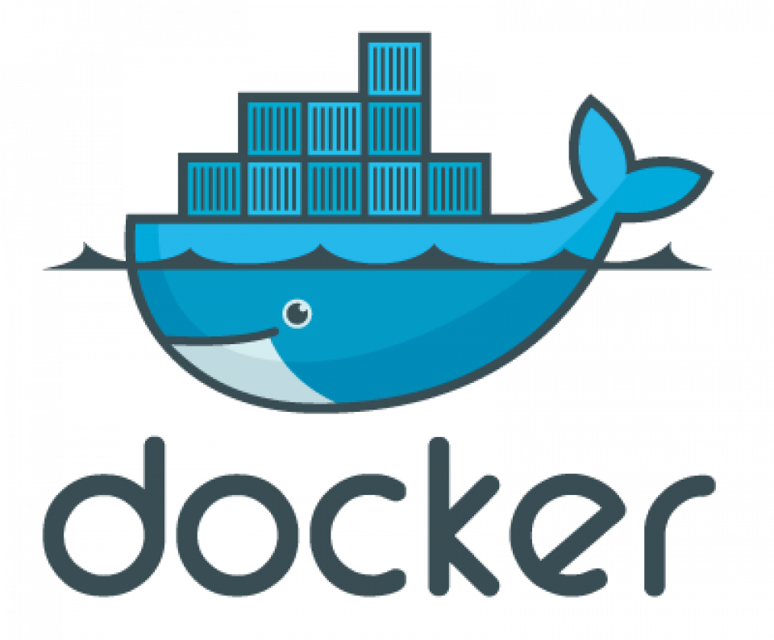

<!--_fontSize:13px-->>

# <!--fit--> Get to Docker

## Session 4

---

## Agenda

- Introduction to yaml
- Docker Compose

---

# <!--fit--> Introduction to yaml

---

## Introduction to yaml

- YAML stands for "YAML Ain't Markup Language" or "Yet Another Markup Language"

- YAML is a human-readable data serialization standard that can be used in conjunction with all programming languages and is often used to write configuration files.

- YAML is a superset of JSON, which means that any valid JSON file is also a valid YAML file.

---

## Introduction to yaml - key-value pairs

- Keys are separated from their values by a colon followed by a space.

- Key-value pairs are separated by a new line.

- Example

  ```yaml
  name: John
  age: 30
  ```

---

## Introduction to yaml - Data Types

- Scalars

  - Strings
  - Numbers
  - Booleans
  - Nulls

- Collections
  - Arrays
  - Dictionaries

---

## Introduction to yaml - Scalars

- Strings `may be plain or quoted`

  ```yaml
  name: John
  ```

- Numbers

  ```yaml
  age: 30
  grade: 9.5
  ```

- Booleans

  ```yaml
  isStudent: true
  ```

- Nulls

  ```yaml
  address: null
  ```

---

## Introduction to yaml - Collections

- Arrays

  ```yaml
  fruits:
    - Apple
    - Banana
    - Orange
  ```

  ```yaml
  fruits: [Apple, Banana, Orange]
  ```

- Dictionaries

  ```yaml
  person:
    name: John
    age: 30
  ```

  ```yaml
  person: { name: John, age: 30 }
  ```

---

## Introduction to yaml - Syntax

- Indentation

  - YAML uses indentation to indicate nesting of elements.

  - The number of spaces is not fixed, but it should be consistent throughout the file.

---

## Introduction to yaml - Syntax

- Example 1

  ```yaml
  person:
    name: John
    age: 30
    address:
      city: New York
      state: NY
  ```

---

## Introduction to yaml - Syntax

- Example 2

  ```yaml
  person:
    - name: John
      age: 30
      address:
        city: New York
        state: NY
    - name: Jane
      age: 25
      address:
        city: Los Angeles
        state: CA
  ```

---

## Introduction to yaml - Complex Example

- Suppose we have a car that may have a

  - color
  - model
  - price
  - transmission

- If we want to store information about single car, we will use dictionaries

  ```yaml
  car:
    color: red
    model: 2021
    price: 20000
    transmission: automatic
  ```

---

## Introduction to yaml - Complex Example

- If the model consists of `year` and `name` then we will represent it as nested dictionaries

  ```yaml
  color: red
  car:
    model:
      year: 2021
      name: corolla
  price: 20000
  transmission: automatic
  ```

---

## Introduction to yaml - Complex Example

- If we want to store the name of 5 cars `store data of same type` we will use `list of strings`

  ```yaml
  cars:
    - corolla
    - civic
    - city
    - vitz
    - prius
  ```

- If we want to store all information of 5 cars `store data of different type` we will use `list of dictionaries`

---

## Introduction to yaml - Complex Example

```yaml
cars:
  - color: red
    model:
      year: 2021
      name: corolla
    price: 20000
    transmission: automatic
  - color: blue
    model:
      year: 2020
      name: civic
    price: 18000
    transmission: manual
  - color: white
    model:
      year: 2019
      name: city
    price: 15000
    transmission: automatic
  - color: black
    model:
      year: 2018
      name: vitz
    price: 17000
    transmission: manual
  - color: silver
    model:
      year: 2017
      name: prius
    price: 16000
    transmission: automatic
```

---

## Introduction to yaml - Notes

- Dictionary is an unordered collection where as lists are ordered collection.

- This means that in the following example

  ```yaml
  person:
    name: John
    age: 30
  ```

  is the same as

  ```yaml
  person:
    age: 30
    name: John
  ```

---

## Introduction to yaml - Notes

- While in the list the order matter

  ```yaml
  fruits:
    - Apple
    - Banana
    - Orange
  ```

  is not the same as

  ```yaml
  fruits:
    - Banana
    - Apple
    - Orange
  ```

---

## Introduction to yaml - Notes

- Any line beginning with a `#` is a comment and will be ignored by the parser.

  ```yaml
  # This is a comment
  person:
    name: John
    age: 30
  ```

---

# <!--fit--> Docker Compose

---

## Docker Compose

- Docker Compose is a tool for defining and running multi-container Docker applications.

- With Compose, you use a YAML file to configure your application's services.

- Then, with a single command, you create and start all the services from your configuration.

---

## Docker Compose - Example

- We will use a popular application provided by Docker to demonstrate the use of Docker Compose.

- The application is a voting app that consists of 5 services

  - Voting App (Python)
  - In-memory DB (Redis)
  - Worker (DotNet)
  - DB (Postgres)
  - Result App (NodeJS)

---

## Docker Compose - Example

### Voting App

- Is a web application developed in python to provide the user with an interface to choose between two options (a cat and a dog).

### In-memory DB

- When you make a selection the vote is stored in Redis

- Redis is used as in memory database

---

## Docker Compose - Example

### Worker

- The vote is then processed by a worker which is an application written in DotNet

- It takes the new vote and update the persistent database

### DB

- The persistent database is Postgres

- It has only one table with the number of votes for each category (cat or dog)

---

## Docker Compose - Example

## Result App

- The result of the vote is displayed in a web application developed in NodeJS

- It reads the count of votes from the postgress database and display it to the user

---

## Docker Compose - Example


---

## Docker Compose - Example

- First we will setup the application stack using `docker run` command

- Then we will use `docker-compose` to setup the same stack

- We will compare the two approaches

---

## Docker Compose - Example

1. Create a redis container

   ```dockerfile
   docker run -d --name=redis redis
   ```

2. Create a postgres container

   ```dockerfile
   docker run -d --name=db postgres
   ```

3. Create a voting app container

   ```dockerfile
   docker run -d --name=vote -p 5000:80 example-voting-app-vote
   ```

---

## Docker Compose - Example

4. Create a result app container

   ```dockerfile
   docker run -d --name=result -p 5001:80 example-voting-app-result
   ```

5. Create a worker container

   ```dockerfile
    docker run -d --name=worker example-voting-app-worker
   ```

---

## Docker Compose - Example


We did not link the containers together

---

## Docker Compose `--link`

- We can link the containers together using `--link` option

- Using `--link` option is depreacted

- if you look at the voting app code you will find that it uses `redis` and `db` as the hostname to connect to the redis and postgres containers

  

  

- This why we named them `redis` and `db` when we created the containers

---

## Docker Compose `--link`

- We need to link the voting app to the redis and postgres containers

  ```dockerfile
    docker run -d --name=vote -p 5000:80 --link redis:redis  example-voting-app-vote
  ```

- We need to link the result app to the postgres container

  ```dockerfile
  docker run -d --name=result -p 5001:80 --link db:db example-voting-app-result
  ```

---

## Docker Compose `--link`

- If you look at the worker code you will find that it uses `redis` and `db` as the hostname to connect to the redis and postgres containers

  

- So we need to link the worker to the redis and postgres containers

  ```dockerfile
  docker run -d --name=worker --link redis:redis --link db:db example-voting-app-worker
  ```

---

## Docker Compose

- So we can start our application stack using the following commands

  ```dockerfile
  docker run -d --name=redis redis
  docker run -d --name=db postgres
  docker run -d --name=vote -p 5000:80 --link redis:redis  example-voting-app-vote
  docker run -d --name=result -p 5001:80 --link db:db example-voting-app-result
  docker run -d --name=worker --link redis:redis --link db:db example-voting-app-worker
  ```

- It is easy to convert the above commands to a `docker-compose.yml` file

---

## Docker Compose - `docker-compose.yml`

- The `docker-compose.yml` file is a file that contains the configuration of all the services that make up the application stack

- The file is written in yaml format

- The file is used by the `docker-compose` command to create and start all the services from the configuration

---

## Docker Compose - `docker-compose.yml`

- `docker compose up` command reads the `docker-compose.yml` file and creates and starts all the services from the configuration

- `docker compose up -d` command does the same but in detached mode

- `docker compose down` command stops and removes all the services from the configuration

- `docker compose ps` command lists all the services from the configuration

---

## Docker Compose - Versions

- Version 1

  - The original version of Compose

  - It is not recommended for production use

  - If you want to deploy containers on different network other than
    default bridge network, there is no way to specify that in version 1

  - If you have a depnedency or start of order between services, there is no way to specify that in version 1

---

## Docker Compose - Versions

- Version 2

  - From version 2 and up you must specify the version of the Compose file format being used

  - It is the most widely used version

  - It supports `networks` and `depends_on` options

  - It is the default version

  - All containers are listed under `services` key

  - Docker automatically create a detecated bridge network for the services, and then attaches all containers to that new netowrk, so all containers can communicate to each others using the service name, so you don't need to use `--link` option
